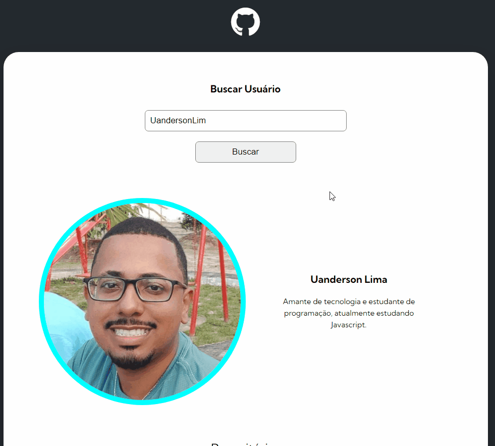

# Projeto feito no Curso Dev-Quest.

# Ferramentas utilizadas

- O projeto está consumindo API do GitHub, assim o usuário pode pesquisar qualquer usuário existente no mesmo, e todos os repositórios e Projetos.

 
     
     
     
     
    

 
